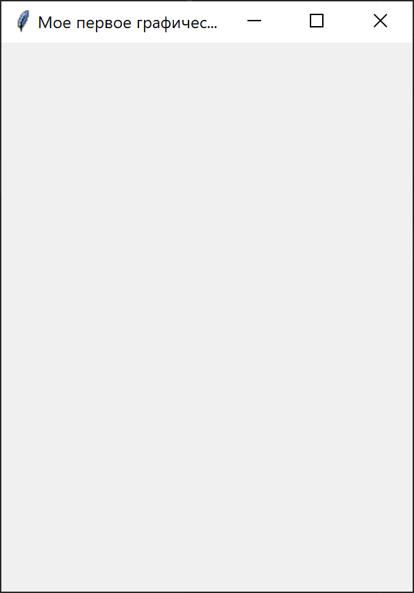
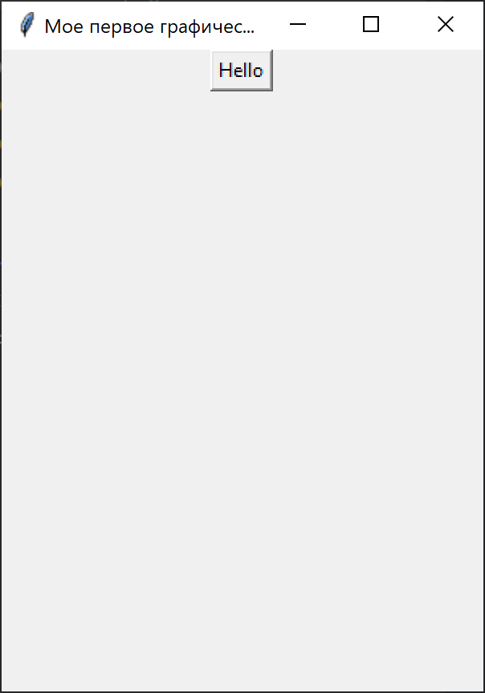
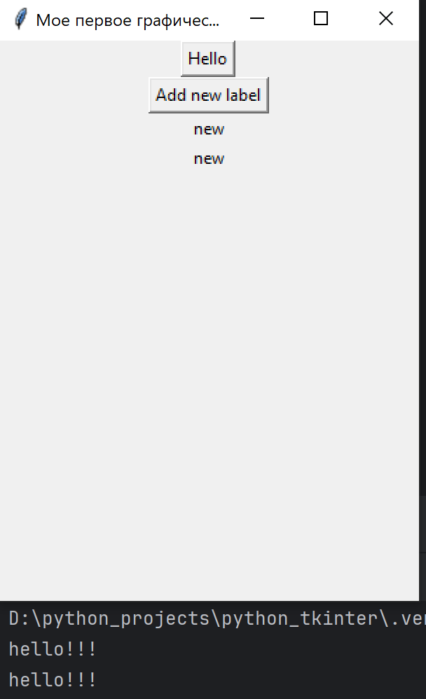
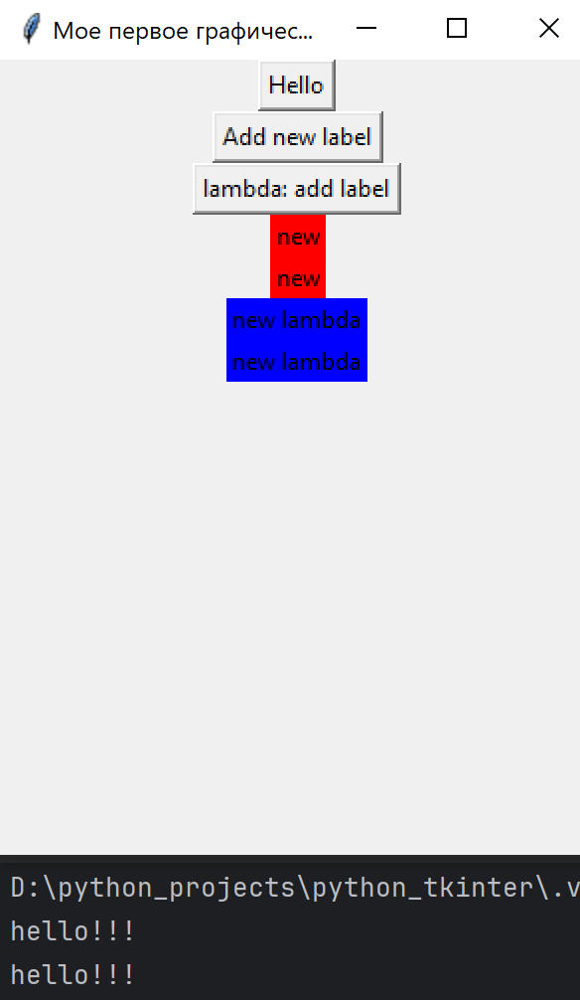
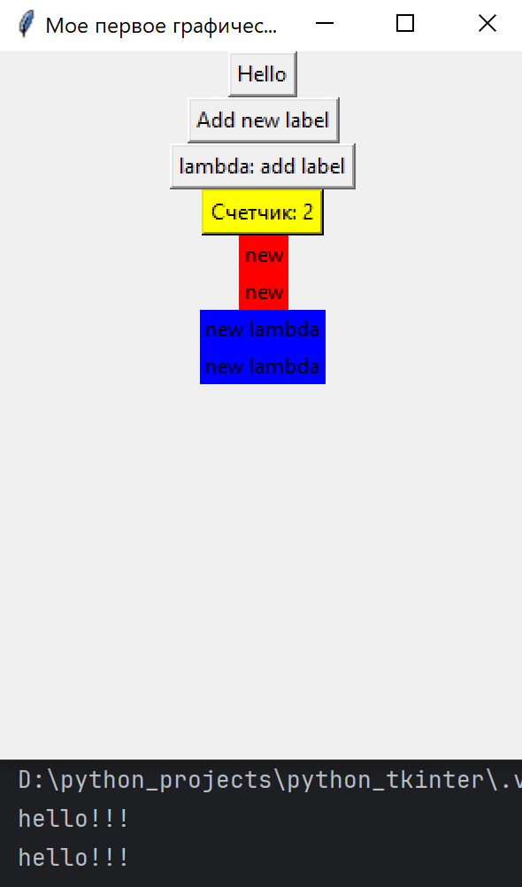

# Курс Tkinter Python на канале  egoroff_channel
[link](https://www.youtube.com/watch?v=mLySBcS-6p0&list=PLQAt0m1f9OHsd6U5okp1XLoYyQR0oBjMM)
## И так приступим:

### Lesson_1
### Введение в tkinter. Главное окно. Научись создать десктопное приложение на Python (GUI (Graphical User Interface) приложение на Python)

### Интерфейс будет состоять из виджетов и мы будем описывать события, которые могут произойти в интерфейсе
### То есть событийное программирование


### Lesson_2
### Создание GUI приложения Python Tkinter. Виджет Label
### Виджеты это главные кирпичи любого окна
### Виджет Label предназначен для отображения текстовой информации.

### Lesson_3 
### Создание GUI приложения Python Tkinter. Виджет Button
### Это самый популярный виджет с которым часто приходится работать
Посмотрим на самый наш базовый код, запускающий первое обычное окно, на котором еще нет виджетов

```python
import tkinter as tk

win = tk.Tk()
win.geometry("300x400+100+200")
win.title("Мое первое графическое приложение!!!")

win.mainloop()
```
Увидим вот такое окно:



Теперь, чтобы добавить виджет, нужно, перед вызовом метода mainloop(),
создать этот самый виджет.

```python
import tkinter as tk

win = tk.Tk()
win.geometry("300x400+100+200")
win.title("Мое первое графическое приложение!!!")

btn1 = tk.Button(win, text="Hello")  
btn1.pack() 
win.mainloop()
```

У модуля tk, вызываем класс Button() тем самым создаем виджет Button
в качестве параметров классу Button передаем где будем его размещать (на нашем окне win)
и передаем текст, который будет на нашей кнопке размещен c помощью именованного параметра text=.

Что-бы увидеть виджет класса Button на окне, его еще нужно расположить на окне,
это делается специальным методом который это делает. У btn1 вызовем такой метод pack()

Теперь увидим следующее:



Видим нашу кнопку, но при нажатии на нее ничего не происходит. Для того что бы сделать что-то,
есть специальный функционал кнопки. При нажатии на кнопку должен исполнятся специальный обработчик.
Давайте такой обработчик создадим. Для этого нужно описать параметры command=куда вставляем переменной
название функции которая будет вызвана (конечно такая функция должна существовать)
и заметим что вставляем ее без вызова самой функции

```python
import tkinter as tk

def say_hello():
    print("Hello")
    

win = tk.Tk()
win.geometry("300x400+100+200")
win.title("Мое первое графическое приложение!!!")

btn1 = tk.Button(win, text="Hello",
                 command=say_hello,                 
                 )  
btn1.pack() 
win.mainloop()
```

Как правило, кнопки, будут работать с другими виджет-ами, или нашим окном.
Создадим еще одну такую кнопку, это будет переменная btn2. По нажатию кнопки с текстом 
"Add new label", создаем новый label, в функции add_label, которую также определим заранее.
В функции add_label создадим этот самый label. Укажем что он будет на окне 
и зададим ему текст заголовка new. И конечно запакуем (отобразим ее) в окне.

```python
import tkinter as tk

def say_hello():
    print("Hello")
 
    
def add_label():
    label = tk.Label(win, text="new", background="red")
    label.pack()
    

win = tk.Tk()
win.geometry("300x400+100+200")
win.title("Мое первое графическое приложение!!!")

btn1 = tk.Button(win, text="Hello",
                 command=say_hello,                 
                 )  
btn2 = tk.Button(win, text="Add new label",
                 command=add_label,                 
                 )  

btn1.pack() 
btn2.pack()
win.mainloop()
```

Можно заметить что функциям для кнопок мы не можем передать никаких аргументов,
так как мы передаем только имя этой функции ее, непосредственно сами, не вызывая.

В итоге получится так, по два раза нажав на обе кнопки


Есть еще важное замечание, в command= нам никто не запрещает передавать lambda функции (анонимные)

Создадим такую третью кнопку btn3, сразу можем к ней метод pack() применить чтобы изменения 
применялись, и ниже как раньше тоже применяем чтобы сама кнопка изначально отображалась.

```python
import tkinter as tk

def say_hello():
    print("Hello")
 
    
def add_label():
    label = tk.Label(win, text="new", background="red")
    label.pack()
    

win = tk.Tk()
win.geometry("300x400+100+200")
win.title("Мое первое графическое приложение!!!")
btn1 = tk.Button(win, text="Hello",
                 command=say_hello,                 
                 )  
btn2 = tk.Button(win, text="Add new label",
                 command=add_label,                 
                 )  
btn3 = tk.Button(win, text="lambda: add label",
                 command=lambda: tk.Label(win, text="new", background="blue").pack(),                 
                 )
btn1.pack() 
btn2.pack()
btn3.pack()
win.mainloop()
```
В итоге получится так, по два раза нажав на три кнопки, дополнительно зададим цвета еще


## Посмотрим горячие клавиши:
<ctrl+d> - для копирования ниже строки на которой курсор расположен.

Как еще один пример сделаем кнопку которая подсчитывает сколько раз кнопка была нажата.
Это буден btn4 с атрибутом text='Счетчик'. Укажем сколько раз она была нажата в переменной count
создадим функцию counter() которая и будет увеличивать переменную count.
Сделаем цвет фона кнопки желтым.

```python
import tkinter as tk

def say_hello():
    print("Hello")
 
    
def add_label():
    label = tk.Label(win, text="new", background="red")
    label.pack()
    
    
def counter():
    global count # используем глобальную функцию
    count+= 1
    btn4['text'] = f"Счетчик: {count}" # изменяем атрибут text на наше значение

count = 0

win = tk.Tk()
win.geometry("300x400+100+200")
win.title("Мое первое графическое приложение!!!")
btn1 = tk.Button(win, text="Hello",
                 command=say_hello,                 
                 )  
btn2 = tk.Button(win, text="Add new label",
                 command=add_label,                 
                 )  
btn3 = tk.Button(win, text="lambda: add label",
                 command=lambda: tk.Label(win, text="new", background="blue").pack(),                 
                 )
btn4 = tk.Button(win, 
                 text=f"Счетчик: {count}",
                 command=counter,
                 bg='yellow'  # цвет фона кнопки
                 )
btn1.pack() 
btn2.pack()
btn3.pack()
btn4.pack()
win.mainloop()
```
В итоге получится так, по два раза нажав на четыре кнопки, дополнительно зададим цвета еще


## Рассмотрим другие свойства кнопки, которые можно изменить.
Увидеть свойства можно зажав <ctrl> навести курсор мыши на класс Button, и провалится
(нажав на него), в инициализацию этого класса. Там будут все свойства какие могут быть.
Увидим вот такое:

STANDARD OPTIONS

            activebackground, activeforeground, anchor,
            background, bitmap, borderwidth, cursor,
            disabledforeground, font, foreground
            highlightbackground, highlightcolor,
            highlightthickness, image, justify,
            padx, pady, relief, repeatdelay,
            repeatinterval, takefocus, text,
            textvariable, underline, wraplength

WIDGET-SPECIFIC OPTIONS

            command, compound, default, height,
            overrelief, state, width

Рассмотрим 
`activebackground` - срабатывает когда наша кнопка нажата, то есть задает цвет фона кнопки когда она нажата
`state` - это состояние кнопки, можно сделать равным tk.DISABLED, то есть кнопка будет неактивна (с ней ничего не сделать)
по умолчанию тут значение tk.NORMAL, еще может быть tk.ACTIVE
