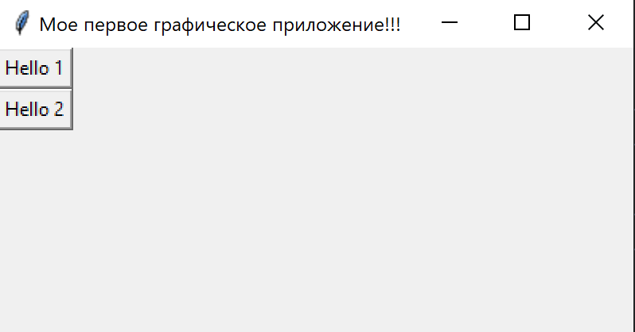
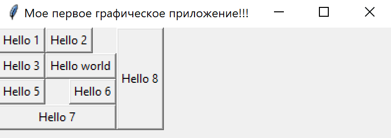

### Lesson_4 
### Как размещать виджеты при помощи метода grid()
Тут сами виджеты изучать не будем, а посмотрим как их можно размещать на нашем окне приложения.
Для начала создадим сами виджеты, для начала добавим кнопки.

Можем зажав <ALT + левый_клик> на нужных строчках выделит их для одновременного набора текста в них
или став на одной строчке и зажав колесико мыши провести по нескольким нужным строчкам.

Расположим две кнопки в окне
```python
import tkinter as tk
win = tk.Tk()
win.geometry("400x500+100+200")
win.title("Мое первое графическое приложение!!!")

btn1 = tk.Button(win, text="Hello 1")
btn2 = tk.Button(win, text="Hello 2")
btn1.pack()
btn2.pack()
win.mainloop()
```
В итоге кнопки будут расположены по центру, друг под другом, добавив еще одну она появится ниже 
и тоже по центру размещение происходит в порядке добавления их в коде. Это все мы видели ранее.

Теперь будем для расположения кнопок использовать метод grid()
```python
import tkinter as tk
win = tk.Tk()
win.geometry("400x500+100+200")
win.title("Мое первое графическое приложение!!!")

btn1 = tk.Button(win, text="Hello 1")
btn2 = tk.Button(win, text="Hello 2")

btn1.grid()
btn2.grid()
win.mainloop()
```
И в итоге кнопки будут расположены в том же порядке каком расположены в коде, но в левом верхнем углу окна.



На это поведение можно влиять при помощи метода grid().
Этот метод позволяет располагать виджеты в виде таблицы. По умолчанию это таблица с одной колонкой (столбцом)
и виджеты в ней располагаются друг за другом каждая в своем ряде (строке). 
Количество колонок и рядов можно менять, для расположения виджета нужно указать номер ряда и колонки.
То есть row и column соответственно
Они начинаются со значений row=0,column=0 это по умолчанию значения, для примера сделаем другие.
```python
import tkinter as tk
win = tk.Tk()
win.geometry("400x500+100+200")
win.title("Мое первое графическое приложение!!!")

btn1 = tk.Button(win, text="Hello 1")
btn2 = tk.Button(win, text="Hello 2")

btn1.grid(row=0, column=0) # row - ряд (строка); column - колонка (столбец)
btn2.grid(row=0, column=1)
win.mainloop()
```
В итоге кнопки станут в одну строку, друг за другом


```python
import tkinter as tk
win = tk.Tk()
win.geometry("400x500+100+200")
win.title("Мое первое графическое приложение!!!")

btn1 = tk.Button(win, text="Hello 1")
btn2 = tk.Button(win, text="Hello 2")

btn1.grid(row=0, column=0) # row - ряд (строка); column - колонка (столбец)
btn2.grid(row=1, column=1) # кнопка 2 в ряде 1 в колонке 1
win.mainloop()
```
В итоге кнопки станут в одну строку, друг за другом


Если указать слишком большую колонку, например в нашем примере 11, то tkinter поймет что это несуществующие
колонки и их не нужно рисовать.

Сделаем побольше кнопок, что бы было интересней.
```python
import tkinter as tk
win = tk.Tk()
win.geometry("400x500+100+200")
win.title("Мое первое графическое приложение!!!")

btn1 = tk.Button(win, text="Hello 1")
btn2 = tk.Button(win, text="Hello 2")
btn3 = tk.Button(win, text="Hello 3")
btn4 = tk.Button(win, text="Hello 4")
btn5 = tk.Button(win, text="Hello 5")
btn6 = tk.Button(win, text="Hello 6")
btn7 = tk.Button(win, text="Hello 7")

btn1.grid(row=0, column=0)  # row - ряд (строка); column - колонка (столбец)
btn2.grid(row=0, column=1)
btn3.grid(row=1, column=0)
btn4.grid(row=1, column=1)
btn5.grid(row=2, column=0)
btn6.grid(row=2, column=1)
btn7.grid(row=3, column=1)
win.mainloop()
```
В итоге эти 7 кнопок будут выглядеть вот так:


Кнопка №7 у нас одна находится в ряде 3 и занимает колонку 1. Иногда нужно растянуть виджет 
на несколько столбцов (колонок). Вот попробуем что бы у нас кнопка №7 занимала обе колонки в ряде 3.
Такое поведение можно сделать, с помощью некоторого атрибута которые передаются методу grid().
Посмотреть эти свойства можно зажав <ctrl> навести курсор мыши на метод grid, и провалится
(нажав на него), в инициализацию класса Grid. И там будут описание параметров которые метод может принимать.
Нас интересует параметр columnspan=2 куда передаем число колонок которые нужно объединить, у нас это 2.
Обращаем внимание что объединение идет от солонки которая указана в свойстве column
```python
import tkinter as tk
win = tk.Tk()
win.geometry("400x500+100+200")
win.title("Мое первое графическое приложение!!!")

btn1 = tk.Button(win, text="Hello 1")
btn2 = tk.Button(win, text="Hello 2")
btn3 = tk.Button(win, text="Hello 3")
btn4 = tk.Button(win, text="Hello 4")
btn5 = tk.Button(win, text="Hello 5")
btn6 = tk.Button(win, text="Hello 6")
btn7 = tk.Button(win, text="Hello 7")

btn1.grid(row=0, column=0)  # row - ряд (строка); column - колонка (столбец)
btn2.grid(row=0, column=1)
btn3.grid(row=1, column=0)
btn4.grid(row=1, column=1)
btn5.grid(row=2, column=0)
btn6.grid(row=2, column=1)
btn7.grid(row=3, column=0, columnspan=2)
win.mainloop()
```
В итоге эти 7 кнопок будут выглядеть вот так:


Видим что он стал посередине и не растянулся на оба столбца. То есть нам нужно что бы эта кнопка занимала
все пространство колонок в ряде 3. Поэтому нужно воспользоваться дополнительно методом stick=  ему строкой 
передаются стороны света куда растягиваться.
- "n"(север), "s" (юг), "w" (запад), "e" (восток)
- "ne", "nw", "sw", "se", "center" (по умолчанию)
```python
import tkinter as tk
win = tk.Tk()
win.geometry("400x500+100+200")
win.title("Мое первое графическое приложение!!!")

btn1 = tk.Button(win, text="Hello 1")
btn2 = tk.Button(win, text="Hello 2")
btn3 = tk.Button(win, text="Hello 3")
btn4 = tk.Button(win, text="Hello 4")
btn5 = tk.Button(win, text="Hello 5")
btn6 = tk.Button(win, text="Hello 6")
btn7 = tk.Button(win, text="Hello 7")

btn1.grid(row=0, column=0)  # row - ряд (строка); column - колонка (столбец)
btn2.grid(row=0, column=1)
btn3.grid(row=1, column=0)
btn4.grid(row=1, column=1)
btn5.grid(row=2, column=0)
btn6.grid(row=2, column=1)
btn7.grid(row=3, column=0, columnspan=2, stick="we")
win.mainloop()
```
В итоге эти 7 кнопок будут выглядеть вот так:


Следующим примером сделаем кнопку которая будет занимать несколько рядов (строк)
Для этого добавим еще одну кнопку. Применим к ней другие параметры.

Теперь сделаем кнопку, которая будет занимать несколько рядов, это будет btn8
Для такого расположения, будем использовать параметр (rowspan=). Куда передаем число рядов
которые нужно объединить, в нашем случае это 4-е ряда. При этом кнопка в 0-ом ряду, во 2-ой колонке
```python
import tkinter as tk
win = tk.Tk()
win.geometry("400x500+100+200")
win.title("Мое первое графическое приложение!!!")

btn1 = tk.Button(win, text="Hello 1")
btn2 = tk.Button(win, text="Hello 2")
btn3 = tk.Button(win, text="Hello 3")
btn4 = tk.Button(win, text="Hello 4")
btn5 = tk.Button(win, text="Hello 5")
btn6 = tk.Button(win, text="Hello 6")
btn7 = tk.Button(win, text="Hello 7")
btn8 = tk.Button(win, text="Hello 8")

btn1.grid(row=0, column=0)  # row - ряд (строка); column - колонка (столбец)
btn2.grid(row=0, column=1)
btn3.grid(row=1, column=0)
btn4.grid(row=1, column=1)
btn5.grid(row=2, column=0)
btn6.grid(row=2, column=1)
btn7.grid(row=3, column=0, columnspan=2, stick="we")
btn8.grid(row=0, column=2, rowspan=4)
win.mainloop()
```
Пока не будем использовать параметр stick=
В итоге эти 8 кнопка будут выглядеть вот так:


Видим что кнопка 8 стала по центру 4-х рядов во 2-ой колонке. 
Теперь нам ее нужно растянуть на всю ширину 4-х рядов в той же второй колонке.
Для этого используем параметр stick='sn'
```python
import tkinter as tk
win = tk.Tk()
win.geometry("400x500+100+200")
win.title("Мое первое графическое приложение!!!")

btn1 = tk.Button(win, text="Hello 1")
btn2 = tk.Button(win, text="Hello 2")
btn3 = tk.Button(win, text="Hello 3")
btn4 = tk.Button(win, text="Hello 4")
btn5 = tk.Button(win, text="Hello 5")
btn6 = tk.Button(win, text="Hello 6")
btn7 = tk.Button(win, text="Hello 7")
btn8 = tk.Button(win, text="Hello 8")

btn1.grid(row=0, column=0)  # row - ряд (строка); column - колонка (столбец)
btn2.grid(row=0, column=1)
btn3.grid(row=1, column=0)
btn4.grid(row=1, column=1)
btn5.grid(row=2, column=0)
btn6.grid(row=2, column=1)
btn7.grid(row=3, column=0, columnspan=2, stick="we")
btn8.grid(row=0, column=2, rowspan=4, stick="sn")
win.mainloop()
```
В итоге эти 8 кнопка будут выглядеть вот так:


Посмотрим еще на свойство stick.
Например, поиграем с кнопкой btn4, переименуем ее в Hello world, в результате 
она занимает больше места чем другие по длине, что испортило всю нашу 'идилию'.
```python
import tkinter as tk
win = tk.Tk()
win.geometry("400x500+100+200")
win.title("Мое первое графическое приложение!!!")

btn1 = tk.Button(win, text="Hello 1")
btn2 = tk.Button(win, text="Hello 2")
btn3 = tk.Button(win, text="Hello 3")
btn4 = tk.Button(win, text="Hello world")
btn5 = tk.Button(win, text="Hello 5")
btn6 = tk.Button(win, text="Hello 6")
btn7 = tk.Button(win, text="Hello 7")
btn8 = tk.Button(win, text="Hello 8")

btn1.grid(row=0, column=0)  # row - ряд (строка); column - колонка (столбец)
btn2.grid(row=0, column=1)
btn3.grid(row=1, column=0)
btn4.grid(row=1, column=1)
btn5.grid(row=2, column=0)
btn6.grid(row=2, column=1)
btn7.grid(row=3, column=0, columnspan=2, stick="we")
btn8.grid(row=0, column=2, rowspan=4, stick="sn")
win.mainloop()
```
В итоге кнопка выглядят вот так:


Теперь что бы понять как действует stick. Мы переместим btn2 в лево на запад "w".
А brn5 переместим в право на восток "e"
```python
import tkinter as tk
win = tk.Tk()
win.geometry("400x500+100+200")
win.title("Мое первое графическое приложение!!!")

btn1 = tk.Button(win, text="Hello 1")
btn2 = tk.Button(win, text="Hello 2")
btn3 = tk.Button(win, text="Hello 3")
btn4 = tk.Button(win, text="Hello world")
btn5 = tk.Button(win, text="Hello 5")
btn6 = tk.Button(win, text="Hello 6")
btn7 = tk.Button(win, text="Hello 7")
btn8 = tk.Button(win, text="Hello 8")

btn1.grid(row=0, column=0)  # row - ряд (строка); column - колонка (столбец)
btn2.grid(row=0, column=1, stick="w")
btn3.grid(row=1, column=0)
btn4.grid(row=1, column=1)
btn5.grid(row=2, column=0)
btn6.grid(row=2, column=1, stick="e")
btn7.grid(row=3, column=0, columnspan=2, stick="we")
btn8.grid(row=0, column=2, rowspan=4, stick="sn")
win.mainloop()
```
В итоге кнопка выглядят вот так:



Можно выровнять их заставив, прижиматься и на запад и на восток указав свойство stick="we".
Но есть еще методы которыми можно задать минимальный размер наших колонок и столбцов
Эти методы применяются к окну. 
Это метод grid_columnconfigure(), первым аргументом которому передается индекс нашей колонки,
и затем свойством minsize=200, передаем минимальный размер колонки
```python
import tkinter as tk
win = tk.Tk()
win.geometry("400x500+100+200")
win.title("Мое первое графическое приложение!!!")

btn1 = tk.Button(win, text="Hello 1")
btn2 = tk.Button(win, text="Hello 2")
btn3 = tk.Button(win, text="Hello 3")
btn4 = tk.Button(win, text="Hello world")
btn5 = tk.Button(win, text="Hello 5")
btn6 = tk.Button(win, text="Hello 6")
btn7 = tk.Button(win, text="Hello 7")
btn8 = tk.Button(win, text="Hello 8")

btn1.grid(row=0, column=0)  # row - ряд (строка); column - колонка (столбец)
btn2.grid(row=0, column=1, stick="w")
btn3.grid(row=1, column=0)
btn4.grid(row=1, column=1)
btn5.grid(row=2, column=0)
btn6.grid(row=2, column=1, stick="e")
btn7.grid(row=3, column=0, columnspan=2, stick="we")
btn8.grid(row=0, column=2, rowspan=4, stick="sn")
win.grid_columnconfigure(0, minsize=200)
win.mainloop()
```
В итоге кнопки выглядят вот так. Видим что нулевая колонка занимает 200 пикселей и остальное все по тем же правилам 
как и раньше у нас отображается:


Теперь наведем еще порядок, пусть вторая колонка (индекс 1) будет занимать 100 пикселей.
и пусть кнопка btn3 занимает все доступное пространство, все ее 200 пикселей.
И так как у нас на других кнопках нет параметров stick= то кнопки не занимают все доступное пространство
```python
import tkinter as tk

win = tk.Tk()
win.geometry("400x500+100+200")
win.title("Мое первое графическое приложение!!!")

btn1 = tk.Button(win, text="Hello 1")
btn2 = tk.Button(win, text="Hello 2")
btn3 = tk.Button(win, text="Hello 3")
btn4 = tk.Button(win, text="Hello world")
btn5 = tk.Button(win, text="Hello 5")
btn6 = tk.Button(win, text="Hello 6")
btn7 = tk.Button(win, text="Hello 7")
btn8 = tk.Button(win, text="Hello 8")

btn1.grid(row=0, column=0)  # row - ряд (строка); column - колонка (столбец)
btn2.grid(row=0, column=1, stick="w")
btn3.grid(row=1, column=0, stick="we")
btn4.grid(row=1, column=1)
btn5.grid(row=2, column=0)
btn6.grid(row=2, column=1, stick="e")
btn7.grid(row=3, column=0, columnspan=2, stick="we")
btn8.grid(row=0, column=2, rowspan=4, stick="sn")
win.grid_columnconfigure(0, minsize=200)
win.grid_columnconfigure(1, minsize=100)
win.mainloop()
```
В итоге кнопки выглядят вот так. 


Так как кнопки у нас используют две координаты такие как колонки и ряды.
То для создания таких табличек кнопок или других виджитов удобнее всего использовать
два вложенных цикла. 
Пусть у нас будет пять рядов, это будет первый цикл, и ряды будем проходить внутренним циклом их будет два.
Внутри создаем кнопку на нашем окне с названием f"Hello {i} [j]"
```python
import tkinter as tk
win = tk.Tk()
win.geometry("400x500+100+200")
win.title("Мое первое графическое приложение!!!")
for i in range(5):
    for j in range(2):
        tk.Button(win, text=f"Hello {i} {j}").grid(row=i, column=j)
win.grid_columnconfigure(0, minsize=200)
win.grid_columnconfigure(1, minsize=100)
win.mainloop()
```
В итоге кнопки выглядят вот так. 


Для аккуратности растянем наши кнопки, на всю занимаемую ими длину.
При помощи параметра stick="we"
```python
import tkinter as tk
win = tk.Tk()
win.geometry("400x500+100+200")
win.title("Мое первое графическое приложение!!!")
for i in range(5):
    for j in range(2):
        tk.Button(win, text=f"Hello {i} {j}").grid(row=i, column=j, stick="we")
win.grid_columnconfigure(0, minsize=200)
win.grid_columnconfigure(1, minsize=100)
win.mainloop()
```
В итоге кнопки выглядят вот так. 


